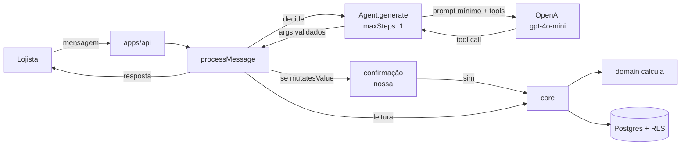

# Mastra + OpenAI — o runtime do assistente

O lojista manda uma mensagem. O Mastra interpreta a intenção e escolhe uma
_tool_. A tool chama um caso de uso de `core`. `domain` calcula. O lojista
recebe um número que é o mesmo do relatório.

Este texto diz **o que o Mastra faz aqui**, **como o laço gira** e **o que ele
está proibido de fazer**. Não substitui a
[documentação do Mastra](https://mastra.ai/docs). Versão de referência no
código: `@mastra/core` ^1.66.

Decisão: [ADR-0010](../../decisoes/adr/0010-mastra-e-gpt-4o-mini.md)
([DEC-007](../../decisoes/README.md#dec-007)). Origem das regras de negócio:
[RF-096 a RF-109](../../produto/requisitos-funcionais.md), README de
[`packages/agent`](../../../packages/agent/README.md).

---

## Em uma frase

**O Mastra é biblioteca dentro de `packages/agent`, não é um serviço.** Usamos
**Agent** + **tools** (`createTool`), chamados por `processMessage()`. O
modelo inicial é `openai/gpt-4o-mini`. **RAG entra** como recuperação auxiliar
([ADR-0017](../../decisoes/adr/0017-rag-com-tools-e-rls.md)): achar candidatos
e trechos; **totais e efeitos em dinheiro** continuam só via tool → `core` →
`domain`. Factory, Studio, servidor HTTP do Mastra, Workflow e Memory do
Mastra **não** entram no caminho do lojista.



## Laço de execução (o que o código faz)

O dono do fluxo **não** é o Mastra. É `processMessage` em `packages/agent`:

1. Resolve `ExecutionContext` (app: sessão; WhatsApp: `PeerDirectory` pelo
   celular do owner — [ADR-0012](../../decisoes/adr/0012-identidade-do-canal-whatsapp.md)).
2. Se há confirmação aberta, trata sim/não/ambiguidade/expiração
   ([RF-103](../../produto/requisitos-funcionais.md),
   [RF-104](../../produto/requisitos-funcionais.md)) — **máquina nossa**, não
   `requireApproval` do Mastra.
3. Chama `LlmPort.decide()` — implementação real: `Agent` + `agent.generate(text, { maxSteps: 1 })`.
4. Valida os args com o mesmo schema Zod de `contracts`.
5. Se a tool `mutatesValue`, grava proposta e pede confirmação; só no "sim"
   executa.
6. Execução real chama o caso de uso de `core` via catálogo em `catalog.ts`.

Detalhe deliberado: nas tools registradas no `Agent` do Mastra, `execute`
**só devolve os argumentos**. Quem grava valor é o catálogo nosso, depois da
confirmação. Assim o `generate` não tem efeito colateral financeiro mesmo se o
modelo disparar a tool.

```
contracts (Zod)  ──→  createTool (Mastra)     → só escolhe intenção + args
                 ──→  defineTool (catálogo)   → executa core após confirmação
                 ──→  rota HTTP               → mesmo schema
```

Porta `LlmPort`: `AGENT_PROVIDER=fake` (local) ou `mastra` (OpenAI). Sem chave,
sobe no falso.

## Primitivos Mastra: o que entra e o que não

| Entra no produto                                                         | Não entra — e por quê                                                                                          |
| ------------------------------------------------------------------------ | -------------------------------------------------------------------------------------------------------------- |
| `Agent` de `@mastra/core/agent`                                          | `new Mastra({ agents })` + rotas `/api/agents` — segunda composição de deps                                    |
| `createTool` de `@mastra/core/tools` com `inputSchema` de `contracts`    | Tool escrita à mão, paralela à rota HTTP                                                                       |
| `agent.generate(..., { maxSteps: 1 })` atrás de `processMessage()`       | Processo `mastra dev` / Studio na porta 4111 como runtime do lojista                                           |
| Modelo `openai/gpt-4o-mini` via `AGENT_MODEL` (`provedor/modelo`)        | Usar chunk do RAG como saldo, faturamento ou estoque (RF-101)                                                  |
| RAG sobre store **nosso** com `company_id` + RLS ([ADR-0017](../../decisoes/adr/0017-rag-com-tools-e-rls.md)) | Índice vetorial sem tenant; Memory/Storage padrão do Mastra em `public`                         |
| `AGENT_PROVIDER=fake` no local                                           | Chave da OpenAI obrigatória para `pnpm dev`                                                                    |
| Confirmação na tabela/store `confirmations` (hoje in-memory, NR-061)     | HITL do Mastra (`requireApproval` / `approveToolCall`) — não isola por empresa nem expira como RF-103 pede     |
| —                                                                        | **Workflow** Mastra — canal e confirmação não são pipeline do framework ([ADR-0012](../../decisoes/adr/0012-identidade-do-canal-whatsapp.md)) |
| —                                                                        | **Memory / Storage** do Mastra em `public` — fechado na [ADR-0016](../../decisoes/adr/0016-memoria-da-conversa-tabelas-nossas.md): histórico de turnos é tabelas nossas |
| —                                                                        | **Channels** / `@chat-adapter/whatsapp` / `MastraAuthBetterAuth`                                               |
| —                                                                        | **Mastra Factory** — plano operacional de projetos de agente; fora do caminho do lojista (ver abaixo)          |

Agent vs Workflow (conceitos do framework): o assistente do lojista é tarefa
aberta (interpretar português → escolher tool) → **Agent**. Sequências fixas
(emitir nota, cobrar, lembrete) ficam em `apps/worker` + `core`, não em
Workflow Mastra.

## Fronteira com o resto do sistema

O runtime mora em `apps/api` — ver
[visão geral](../visao-geral.md#o-runtime-do-agente-mora-na-api). Motivo: o
mesmo `ExecutionContext`, a mesma autenticação, as mesmas portas. Um servidor
Mastra ao lado criaria uma segunda composição, e os dois canais (app e
WhatsApp) começariam a divergir.

`packages/agent` importa `core`, `contracts` e `money`. **Não** importa `db`
nem `domain`. O Mastra não fura essa matriz.

O agente **nunca calcula**. Se alguém ligar uma tool de calculadora, ou deixar
o modelo "somar os itens", isso viola [RF-101](../../produto/requisitos-funcionais.md)
e a linha mais importante de [`seguranca.md`](../seguranca.md#segurança-do-assistente).

Isolamento cruzado é `ExecutionContext` + tools sem id de terceiro + RLS — não
processor Mastra.

## Modelo

| Variável         | Valor inicial                       | Notas                                      |
| ---------------- | ----------------------------------- | ------------------------------------------ |
| `AGENT_PROVIDER` | `fake` no local, `mastra` com chave | Sem chave, o sistema sobe no falso         |
| `AGENT_MODEL`    | `openai/gpt-4o-mini`                | Formato Mastra `provedor/modelo`           |
| `OPENAI_API_KEY` | vazia no local                      | Obrigatória só com `AGENT_PROVIDER=mastra` |

Trocar o modelo (tamanho ou provedor que o Mastra roteie) é configuração. Trocar
o framework reabre a [ADR-0010](../../decisoes/adr/0010-mastra-e-gpt-4o-mini.md).

## Memória

Fechada na [ADR-0016](../../decisoes/adr/0016-memoria-da-conversa-tabelas-nossas.md)
([DEC-011](../../decisoes/README.md#dec-011)):

| Regra            | Valor                                                                 |
| ---------------- | --------------------------------------------------------------------- |
| Onde             | `conversations` / `messages` / `confirmations` com `company_id` + RLS |
| Mastra Memory    | **desligado** (sem Storage padrão em `public`)                        |
| Chave            | empresa + canal + peer (`wa:${companyId}:${peer}` no WhatsApp)        |
| Prompt           | no máximo **12** mensagens da conversa ativa                          |
| Idle (RF-106)    | **2 h** sem mensagem → não aplicar anáfora antiga a ação nova         |
| Retenção (RNF-035) | corpos de mensagem **30 dias**, depois expurgo verificável          |
| Aprendizado      | só contexto por empresa — **sem** treino de modelo                    |

Confirmação sensível continua máquina nossa (NR-061). Contexto isolado é
NR-062. O precedente de schema isolado do Better Auth (`identidade`) **não**
se aplica aqui: as tabelas do assistente já nascem no domínio com RLS.

## RAG

Fechado na [ADR-0017](../../decisoes/adr/0017-rag-com-tools-e-rls.md)
(revisa o ponto 3 da [ADR-0010](../../decisoes/adr/0010-mastra-e-gpt-4o-mini.md)):

| Regra            | Valor                                                                 |
| ---------------- | --------------------------------------------------------------------- |
| Papel            | Recuperar candidatos / trechos (catálogo, FAQ, opcionalmente chat)    |
| Verdade de valor | Só tool → `core` → `domain` — chunk **não** vira saldo nem total      |
| Store            | Nosso, com `company_id` + RLS; API de RAG do Mastra só se apontar nele |
| Prompt           | top‑k do tenant atual, teto de tokens (RNF-075)                       |
| Fora             | Memory Mastra como índice; RAG cross-tenant; preço “lido” do chunk    |

Implementação: [NR-120](../../processo/task-ledger.md).

## Mastra Factory — fora do caminho do produto

[Mastra Factory](https://mastra.ai) é o plano de controle operacional de
**projetos de agente** no ecossistema Mastra (`mastra api factory`: projects,
work items, stages, decisions, attention, supervisor). Serve para filas de
trabalho de desenvolvimento/automação de agentes — Intake → Triage → Planning →
execução com sessões duráveis, aprovações e métricas.

**No Na Régua isso não é runtime do lojista.** Conversas do assistente não
viram work item Factory; confirmação de venda não é `decision approve` do
Factory; o webhook WhatsApp não passa por `/web/*`.

O que existe no repositório:

| Peça                                         | Papel                                                                 |
| -------------------------------------------- | --------------------------------------------------------------------- |
| `@mastra/core` em `packages/agent`           | Biblioteca de Agent/tools no produto                                  |
| `.agents/skills/mastra`                      | Skill para agentes de código seguirem a API atual do framework        |
| `.agents/skills/mastra-factory`              | Skill para supervisionar Factory **quando** houver projeto Factory    |

Se no futuro a equipe usar Factory para construir ou operar um agente na
plataforma Mastra, isso é processo de engenharia — não muda a composição em
`apps/api` nem a ADR-0010.

## Dado que viaja para a OpenAI

[RNF-075](../../produto/requisitos-nao-funcionais.md): o contexto enviado é o
mínimo necessário. Na prática:

- a tool devolve o resultado já calculado por `core` / `domain`;
- o RAG manda só top‑k chunks do tenant (não extrato, não XML, não lista
  inteira de clientes);
- consumo medido por empresa desde o primeiro dia
  ([RNF-073](../../produto/requisitos-nao-funcionais.md)), inclusive embedding.

A OpenAI é subprocessador. Declarar isso na política é a [DEC-016](../../decisoes/README.md#dec-016).

## Canal

O provedor WhatsApp é a Cloud API
([ADR-0014](../../decisoes/adr/0014-meta-cloud-api.md)).
A identidade do canal fechou na [ADR-0012](../../decisoes/adr/0012-identidade-do-canal-whatsapp.md):
não há Workflow Mastra, `MastraServer`, Channel adapter nem auth Mastra no
webhook. Sem o adapter real o runtime se exercita pelo `POST /agent/messages` e
`AGENT_PROVIDER=fake`. O webhook, na NR-046, entra atrás da mesma
`processMessage`.
