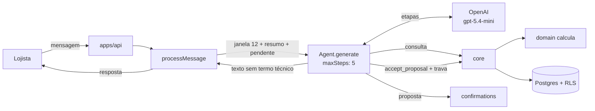

# Mastra + OpenAI — o runtime do assistente

O lojista manda uma mensagem. O agente raciocina em até 5 etapas: consulta
pelas _tools_ (que chamam casos de uso de `core`, onde `domain` calcula) e
redige a resposta a partir do resultado. O lojista recebe um número que é o
mesmo do relatório, em português comum.

Este texto diz **o que o Mastra faz aqui**, **como o laço gira** e **o que ele
está proibido de fazer**. Não substitui a
[documentação do Mastra](https://mastra.ai/docs). Versão de referência no
código: `@mastra/core` ^1.70.

Decisão: [ADR-0010](../../decisoes/adr/0010-mastra-e-gpt-4o-mini.md)
([DEC-007](../../decisoes/README.md#dec-007)). Origem das regras de negócio:
[RF-096 a RF-109](../../produto/requisitos-funcionais.md), README de
[`packages/agent`](../../../packages/agent/README.md).

---

## Em uma frase

**O Mastra é biblioteca dentro de `packages/agent`, não é um serviço.** Um
`Agent` de **até 5 etapas** (`createBuddyBrain`), chamado por
`processMessage()`. As consultas executam o caso de uso de `core` **dentro do
laço** e o modelo redige a resposta a partir do resultado real. Gravação só
por **proposta e aceite**, na tabela `confirmations`. Modelo padrão
`openai/gpt-5.4-mini`. **RAG entra** como recuperação auxiliar
([ADR-0017](../../decisoes/adr/0017-rag-com-tools-e-rls.md)): achar candidatos
e trechos; **totais e efeitos em dinheiro** continuam só via tool → `core` →
`domain`. **Memory**, **Storage**, **HITL** e **Workflow** do Mastra **não**
entram. **Studio** e um servidor Mastra de **desenvolvimento** entram só como
harness de engenharia ([NR-121](../../processo/task-ledger.md)): substituto do
WhatsApp no teste, sempre atrás do mesmo `processMessage` — **não** como canal
do lojista. Desenho completo: [spec 013](../../../specs/013-buddy-conversa-natural/plan.md).


```mermaid
flowchart LR
  L["Lojista"] -->|"mensagem"| API["apps/api"]
  API --> PM["processMessage"]
  PM -->|"janela 12 + resumo + pendente"| AG["Agent.generate<br/>maxSteps: 5"]
  AG <-->|"etapas"| OAI["OpenAI<br/>gpt-5.4-mini"]
  AG -->|"consulta"| C["core"]
  AG -->|"proposta"| CONF["confirmations"]
  AG -->|"accept_proposal + trava"| C
  C --> D["domain calcula"]
  C --> DB[("Postgres + RLS")]
  AG -->|"texto sem termo técnico"| PM
  PM -->|"resposta"| L
```

## Laço de execução (o que o código faz)

O dono do fluxo **não** é o Mastra. É `processMessage` em `packages/agent`:

1. Resolve `ExecutionContext` (app: sessão; WhatsApp: `PeerDirectory` pelo
   celular do owner — [ADR-0012](../../decisoes/adr/0012-identidade-do-canal-whatsapp.md)).
2. Foto recebe o pedido de texto, sem modelo. Teto de IA configurado e estourado
   recebe o aviso fixo.
3. Carrega a janela ativa (até 12 mensagens, idle de 2 h) e monta o **resumo de
   entidades** a partir do snapshot `v: 2` em `messages.tool_calls`
   ([ADR-0016](../../decisoes/adr/0016-memoria-da-conversa-tabelas-nossas.md)).
4. Busca a proposta pendente. Vencida: `expired` e um aviso ao modelo.
5. Chama `BuddyBrain.conversar()`: `agent.generate(mensagens, { maxSteps: 5,
maxProcessorRetries: 1, requestContext, system, activeTools, prepareStep })`.
   O `ExecutionContext`, o texto da dona e a pendente vão no `RequestContext`,
   que **não** entra no prompt. Na quinta etapa, `prepareStep` força
   `toolChoice: 'none'`.
6. Registra o uso de IA por etapa, rejeita a pendente se o modelo mudou de
   assunto sem decidi-la, grava o turno com o snapshot e devolve `answer`,
   `confirmation` (proposta nova) ou `ignored`. Exceção vira frase fixa.

Gravação: as tools de gravação só gravam uma `PendingConfirmation` com os
`args` já validados por `contracts`. `accept_proposal` (ativa só com pendente)
roda a trava `ehConcordanciaPura` sobre o texto da dona — dado novo ou ressalva
nunca grava — e executa o caso de uso com `idempotencyKey = confirmation:{id}`.

Nada técnico na tela: as tools devolvem visões humanizadas (reais, rótulos em
português, sem campo vazio); o processador de saída `sem-termo-tecnico` pede uma
reescrita se aparecer UUID, código interno, nome de campo/tool ou centavos; e
`limparTermosTecnicos` remove o que sobrar.

```
contracts (Zod)  ──→  createTool (Mastra)  → consulta executa core; gravação propõe
                 ──→  accept_proposal      → executa core após a trava
                 ──→  rota HTTP            → mesmo schema
```

O processo que serve só monta o brain quando `OPENAI_API_KEY` existe e o
porteiro está aberto; a chave vai na configuração do modelo
(`{ id: AGENT_MODEL, apiKey }`), não em `process.env`. A CI não chama a
OpenAI: os testes usam o `MastraLanguageModelV2Mock` do próprio Mastra no
`Agent` real. A avaliação com o modelo real é `pnpm --filter @na-regua/agent eval`.

| Ambiente     | Chave    | `AGENT_HARNESS` | Runtime |
| ------------ | -------- | --------------- | ------- |
| Não produção | presente | irrelevante     | Mastra  |
| Não produção | ausente  | irrelevante     | Ausente |
| Produção     | presente | `1`             | Mastra  |
| Produção     | presente | desligado       | Ausente |
| Produção     | ausente  | qualquer        | Ausente |

## Catálogo

Tools em [`packages/agent/src/tools/`](../../../packages/agent/src/tools/).
Contrato: [`buddy-runtime.md`](../../../specs/013-buddy-conversa-natural/contracts/buddy-runtime.md).

| Grupo    | Tools                                                                                                                                                                                                                                                                                      | Efeito                                       |
| -------- | ------------------------------------------------------------------------------------------------------------------------------------------------------------------------------------------------------------------------------------------------------------------------------------------ | -------------------------------------------- |
| Leitura  | `find_customer`, `find_product`, `list_sales`, `period_summary`, `revenue_by_month`, `check_stock`, `search_products`, `check_customer_wallet`, `list_payables`, `list_receivables`, `day_agenda`, `rank_customers`, `rank_products`                                                       | Executa `core` no laço; visão humanizada     |
| Proposta | `create_customer`, `update_customer`, `mark_customer_deleted`, `create_product`, `update_product`, `mark_product_deleted`, `create_sale`, `cancel_sale`, `create_payable`, `create_receivable`, `settle_payable`, `settle_receivable`, `adjust_stock`, `create_appointment`, `send_charge` | Grava `PendingConfirmation`; não toca `core` |
| Aceite   | `accept_proposal`, `cancel_proposal`                                                                                                                                                                                                                                                       | Só com pendente; trava antes de gravar       |
| Recusa   | `refuse_certificate`, `refuse_banking`, `refuse_invoice_command`, `refuse_delete_account_or_contact`                                                                                                                                                                                       | Devolve a regra; o modelo redige             |

## Harness (NR-060)

`POST /agent/messages` é canal de **desenvolvedor**, não produto do lojista.
A sessão é de **fixture** (criar usuário/empresa de teste, popular dados,
autenticar); `companyId` nunca vem no body. Serve em não-produção; em staging,
`AGENT_HARNESS=1`. Produção: `POST /agent/messages` desligado até NR-113;
o Studio (NR-121) é só harness de engenharia e **não** monta o adapter.
Sem chave, o mesmo endpoint responde 503 mesmo com a flag. Teto de IA:
`AGENT_MONTHLY_BUDGET_CENTS` (degradação avisada; não executa tool que muta
valor). A CI prova o laço com o modelo dublê do Mastra, sem OpenAI:
[quickstart](../../../specs/010-assistente-sempre-openai/quickstart.md).
Studio: [quickstart NR-121](../../../specs/003-studio-harness/quickstart.md).

## Primitivos Mastra: o que entra e o que não

| Entra no produto                                                                                              | Não entra — e por quê                                                                                                                                                   |
| ------------------------------------------------------------------------------------------------------------- | ----------------------------------------------------------------------------------------------------------------------------------------------------------------------- |
| `Agent` de `@mastra/core/agent`                                                                               | Rotas `/api/agents` do Mastra como **canal do lojista** (segunda composição de deps)                                                                                    |
| `createTool` de `@mastra/core/tools` com `inputSchema` de `contracts`                                         | Tool escrita à mão, paralela à rota HTTP                                                                                                                                |
| `agent.generate(..., { maxSteps: 5 })` atrás de `processMessage()`                                            | Studio / `mastra dev` como **runtime de produção** do lojista                                                                                                           |
| Harness Studio de eng. ([NR-121](../../processo/task-ledger.md)) → mesmo `processMessage`                     | Studio que desvie do laço (confirmação/memória/`core` paralelos)                                                                                                        |
| Modelo `openai/gpt-5.4-mini` via `AGENT_MODEL` (`provedor/modelo`)                                            | Usar chunk do RAG como saldo, faturamento ou estoque (RF-101)                                                                                                           |
| RAG sobre store **nosso** com `company_id` + RLS ([ADR-0017](../../decisoes/adr/0017-rag-com-tools-e-rls.md)) | Índice vetorial sem tenant; Memory/Storage padrão do Mastra em `public`                                                                                                 |
| Sem `OPENAI_API_KEY` a API sobe e o assistente fica 503                                                       | Chave da OpenAI obrigatória para `pnpm dev` subir o processo inteiro                                                                                                    |
| Confirmação na tabela `confirmations` (Postgres + stub em `conversations`; NR-061)                            | HITL do Mastra (`requireApproval` / `requireToolApproval` / `approveToolCall`) — não isola por empresa nem expira como RF-103 pede                                      |
| —                                                                                                             | **Workflow** Mastra — canal e confirmação não são pipeline do framework ([ADR-0012](../../decisoes/adr/0012-identidade-do-canal-whatsapp.md))                           |
| —                                                                                                             | **Memory / Storage** do Mastra em `public` — fechado na [ADR-0016](../../decisoes/adr/0016-memoria-da-conversa-tabelas-nossas.md): histórico de turnos é tabelas nossas |
| —                                                                                                             | **Channels** / `@chat-adapter/whatsapp` / `MastraAuthBetterAuth`                                                                                                        |
| —                                                                                                             | **Mastra Factory** — plano operacional de projetos de agente; fora do caminho do lojista (ver abaixo)                                                                   |

Agent vs Workflow (conceitos do framework): o assistente do lojista é tarefa
aberta (interpretar português → escolher tool) → **Agent**. Sequências fixas
(emitir nota, cobrar, lembrete) ficam em `apps/worker` + `core`, não em
Workflow Mastra.

## Fronteira com o resto do sistema

O runtime mora em `apps/api` — ver
[visão geral](../visao-geral.md#o-runtime-do-agente-mora-na-api). Motivo: o
mesmo `ExecutionContext`, a mesma autenticação, as mesmas portas. Um servidor
Mastra ao lado criaria uma segunda composição, e os dois canais (app e
WhatsApp) começariam a divergir.

`packages/agent` importa `core`, `contracts` e `money`. **Não** importa `db`
nem `domain`. O Mastra não fura essa matriz.

O agente **nunca calcula**. Se alguém ligar uma tool de calculadora, ou deixar
o modelo "somar os itens", isso viola [RF-101](../../produto/requisitos-funcionais.md)
e a linha mais importante de [`seguranca.md`](../seguranca.md#segurança-do-assistente).

Isolamento cruzado é `ExecutionContext` + tools sem id de terceiro + RLS — não
processor Mastra.

## Modelo

| Variável                     | Valor inicial                        | Notas                                                              |
| ---------------------------- | ------------------------------------ | ------------------------------------------------------------------ |
| `AGENT_MODEL`                | `openai/gpt-5.4-mini`                | Formato Mastra `provedor/modelo`. Só é lida quando a chave existe  |
| `AGENT_HARNESS`              | ausente                              | `1` libera HTTP + Studio em produção (staging). Mesmo porteiro     |
| `AGENT_STUDIO_PRESETS`       | `packages/agent/studio/presets.json` | Path do JSON de presets (NR-121). Ausente/vazio = esse default     |
| `AGENT_MONTHLY_BUDGET_CENTS` | vazio = sem teto                     | Teto de IA por empresa/mês (RNF-073)                               |
| `OPENAI_API_KEY`             | vazia no parse                       | Opcional para a API subir; obrigatória só para o assistente montar |

Trocar o modelo (tamanho ou provedor que o Mastra roteie) é configuração. Trocar
o framework reabre a [ADR-0010](../../decisoes/adr/0010-mastra-e-gpt-4o-mini.md).

## Memória

[NR-062](../../processo/task-ledger.md) **feita**. Fechada na
[ADR-0016](../../decisoes/adr/0016-memoria-da-conversa-tabelas-nossas.md)
([DEC-011](../../decisoes/README.md#dec-011)):

| Regra              | Valor                                                                                    |
| ------------------ | ---------------------------------------------------------------------------------------- |
| Onde               | `conversations` / `messages` / `confirmations` com `company_id` + RLS                    |
| Mastra Memory      | **desligado** (sem `@mastra/memory`; sem Storage padrão em `public`)                     |
| Identidade SQL     | coluna `number_from` — o “peer” da prosa é o interlocutor WhatsApp, não o nome da coluna |
| Chave              | `wa:{companyId}:{peer}` (Studio) e `app:{companyId}:{userId}` (HTTP) — chaves distintas  |
| Prompt             | no máximo **12** mensagens da conversa ativa                                             |
| Idle (RF-106)      | **2 h** sem mensagem → não aplicar anáfora antiga a ação nova                            |
| Retenção (RNF-035) | corpos de mensagem **30 dias**, depois expurgo verificável                               |
| Aprendizado        | só contexto por empresa — **sem** treino de modelo                                       |

Confirmação sensível é máquina nossa na tabela `confirmations`, ligada ao
stub de `conversations` (NR-061). `InMemoryConfirmations` fica só no teste.
HITL (`requireToolApproval`) **não** entra. Histórico em `messages` com RLS
é NR-062. O precedente de schema isolado do Better Auth (`identidade`) **não**
se aplica aqui: as tabelas do assistente já nascem no domínio com RLS.

## RAG

Fechado na [ADR-0017](../../decisoes/adr/0017-rag-com-tools-e-rls.md)
(revisa o ponto 3 da [ADR-0010](../../decisoes/adr/0010-mastra-e-gpt-4o-mini.md)):

| Regra            | Valor                                                                  |
| ---------------- | ---------------------------------------------------------------------- |
| Papel            | Recuperar candidatos / trechos (catálogo, FAQ, opcionalmente chat)     |
| Verdade de valor | Só tool → `core` → `domain` — chunk **não** vira saldo nem total       |
| Store            | Nosso, com `company_id` + RLS; API de RAG do Mastra só se apontar nele |
| Prompt           | top‑k do tenant atual, teto de tokens (RNF-075)                        |
| Fora             | Memory Mastra como índice; RAG cross-tenant; preço “lido” do chunk     |

Implementação: [NR-120](../../processo/task-ledger.md).

## Mastra Factory — fora do caminho do produto

[Mastra Factory](https://mastra.ai) é o plano de controle operacional de
**projetos de agente** no ecossistema Mastra (`mastra api factory`: projects,
work items, stages, decisions, attention, supervisor). Serve para filas de
trabalho de desenvolvimento/automação de agentes — Intake → Triage → Planning →
execução com sessões duráveis, aprovações e métricas.

**No Na Régua isso não é runtime do lojista.** Conversas do assistente não
viram work item Factory; confirmação de venda não é `decision approve` do
Factory; o webhook WhatsApp não passa por `/web/*`.

O que existe no repositório:

| Peça                               | Papel                                                              |
| ---------------------------------- | ------------------------------------------------------------------ |
| `@mastra/core` em `packages/agent` | Biblioteca de Agent/tools no produto                               |
| `.agents/skills/mastra`            | Skill para agentes de código seguirem a API atual do framework     |
| `.agents/skills/mastra-factory`    | Skill para supervisionar Factory **quando** houver projeto Factory |

Se no futuro a equipe usar Factory para construir ou operar um agente na
plataforma Mastra, isso é processo de engenharia — não muda a composição em
`apps/api` nem a ADR-0010.

## Dado que viaja para a OpenAI

[RNF-075](../../produto/requisitos-nao-funcionais.md): o contexto enviado é o
mínimo necessário. Na prática:

- a tool devolve o resultado já calculado por `core` / `domain`;
- o RAG manda só top‑k chunks do tenant (não extrato, não XML, não lista
  inteira de clientes);
- consumo medido por empresa desde o primeiro dia
  ([RNF-073](../../produto/requisitos-nao-funcionais.md)), inclusive embedding.

A OpenAI é subprocessador. Declarar isso na política é a [DEC-016](../../decisoes/README.md#dec-016).

## Canal e harness Studio

O provedor WhatsApp é a Cloud API
([ADR-0014](../../decisoes/adr/0014-meta-cloud-api.md)).
A identidade do canal fechou na [ADR-0012](../../decisoes/adr/0012-identidade-do-canal-whatsapp.md):
não há Workflow Mastra, Channel adapter nem auth Mastra no webhook. Sem o
adapter real o runtime se exercita pelo `POST /agent/messages` (sessão de
fixture, com `OPENAI_API_KEY` e o porteiro FR-001b) e pelo **Mastra Studio**
([NR-121](../../processo/task-ledger.md)) como substituto do Zap em
engenharia. O webhook Meta (NR-046), depois do E11 + RAG + PeerDirectory
(NR-113), entra atrás da mesma `processMessage`.

### Studio = relé → `processMessage`

O adapter [`@mastra/fastify`](https://mastra.ai/reference/server/fastify-adapter.md)
monta no **mesmo** Fastify de `apps/api`, prefixo `/api`, **só** quando o
porteiro libera (`motivoDoAgenteIndisponivel() === undefined`) **e** o
arquivo de presets carregou. Produção e lojista: adapter **não** monta
(`/api/agents` = 404).

A instância Mastra do harness registra **um** agent, `studio-harness`. A
única tool é `process_message`. O `execute` chama `processMessage` com
`channel: 'whatsapp'` e o peer forjado resolvido no servidor. O generate do
Studio **não** chama OpenAI: o model do relé só encaminha o texto. A chamada
ao modelo, quando a chave existe, ocorre dentro de `processMessage`. A CI
roteiriza o modelo com o dublê do Mastra e não chama a OpenAI.

**Não há `/api/agents` de negócio.** O agent `buddy` (tools de consulta,
proposta e aceite) continua atrás de `BuddyBrain.conversar()` — não aparece na
lista do Studio. Registrar tools de venda/cadastro no adapter furaria a
confirmação e o `core`.

```
Studio chat → POST /api/agents/studio-harness/generate
           → relé (tool process_message)
           → processMessage({ channel: 'whatsapp', peer })
           → BuddyBrain (agent buddy) → tools → core
```

Envelope da tool (visível no painel): `{ kind, text, durationMs, confirmationId? }`.
`durationMs` é envio → `processMessage` retornou (RNF-006). Log estruturado
`agent.studio.turn` (`companyId`, peer mascarado, `durationMs`, `kind`,
`requestId`) — sem PII em claro (RNF-034).

### Presets (número forjado)

Arquivo JSON (`AGENT_STUDIO_PRESETS`, default
`packages/agent/studio/presets.json`). Exemplo versionado:
`packages/agent/studio/presets.example.json`. Cada preset amarra `id` +
peer E.164 forjado + `companyId` / `userId` / `role: 'owner'` da fixture.
`companyId` no request context do cliente é **ignorado**. Peer duplicado
recusa o load (adapter não monta; API segue). Contrato:
[studio-harness.md](../../../specs/003-studio-harness/contracts/studio-harness.md),
[presets.md](../../../specs/003-studio-harness/contracts/presets.md).

`POST /agent/messages` permanece estrito (`text` só, `channel: 'app'`).
Studio não altera esse schema.
