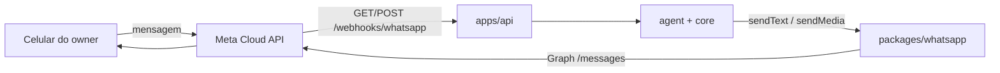

# Meta Cloud API — o que a plataforma faz no WhatsApp

A [Cloud API](https://developers.facebook.com/docs/whatsapp/cloud-api) é o
**fio** entre o chip e o assistente: recebe a mensagem do lojista e devolve
a resposta. Não interpreta intenção e não grava venda. Isso é
[`packages/agent`](../../../packages/agent/README.md) e `core`.

Este texto diz **o que nós mandamos** e **o que nós gravamos**. Não substitui
a documentação da Meta.

Decisão: [ADR-0014](../../decisoes/adr/0014-meta-cloud-api.md)
([DEC-003](../../decisoes/README.md#dec-003)). Identidade do peer:
[ADR-0012](../../decisoes/adr/0012-identidade-do-canal-whatsapp.md). Porta:
[`packages/whatsapp`](../../../packages/whatsapp/README.md).

---

## Em uma frase

**Um número de negócio nosso; o celular do owner é o interlocutor.** A Meta
hospeda a API. Nós não instalamos WhatsApp no servidor e não criamos WABA
por loja.

**Caminho ao vivo:** com `WHATSAPP_PROVIDER=meta` e credenciais completas, a Meta
bate em `GET`/`POST /webhooks/whatsapp` (verificação, mensagem, recibo ignorado).
**Local e CI** ficam em `fake`: `POST /agent/messages` no harness e o worker de
envio não trocam de adapter nesta entrega. Cobrança ao cliente final e templates
aprovados **não** entram na NR-046 — a janela de 24 h continua recusando sem
modelo na rota. Aceite no chip de teste: [quickstart seção 3](../../../specs/009-conversa-agente-whatsapp/quickstart.md#3-aceite-no-número-de-teste-manual).

---

## Termos em uma linha

| Falamos…              | Quer dizer                                                                                        |
| --------------------- | ------------------------------------------------------------------------------------------------- |
| **WABA**              | WhatsApp Business Account da **plataforma**. Uma só.                                              |
| **Phone number ID**   | Identificador Graph do nosso número. É `WHATSAPP_PHONE_NUMBER_ID`.                                |
| **System user token** | Bearer permanente. É `WHATSAPP_API_TOKEN`.                                                        |
| **App secret**        | HMAC do webhook (`X-Hub-Signature-256`). Cabe em `WHATSAPP_WEBHOOK_SECRET`.                       |
| **Verify token**      | String nossa no handshake `GET` do webhook. A NR-046 adiciona a variável se ainda faltar.         |
| **Janela de 24 h**    | Depois da última mensagem **do lojista**, texto livre não sai; só modelo aprovado.                |
| **Modelo**            | Template na Meta. Fora da fatia NR-046; a rota devolve 200 e não envia modelo se a janela fechou. |
| **Peer**              | O número de quem mandou. Liga em `users.phone` do owner — não no WABA.                            |

---

## O que entra neste adapter

| Entra                                            | Não entra                                              |
| ------------------------------------------------ | ------------------------------------------------------ |
| `GET`/`POST /webhooks/whatsapp` quando `meta`    | BSP, Baileys, whatsapp-web.js                          |
| `POST /{phone-number-id}/messages` texto e mídia | Cobrança ao cliente (`sendCustomerCharge`) nesta fatia |
| Webhook `POST` com corpo bruto + HMAC            | Decidir se o número está vinculado (isso é `core`)     |
| Handshake `GET` de verificação                   | WABA ou embedded signup por lojista                    |
| Recusa `outside_service_window` sem template     | Envio em massa, modelos aprovados nesta fatia          |
| `WHATSAPP_PROVIDER=fake` no local e na CI        | Interpretar opt-out ou comando (isso é `core` / agent) |

Consentimento continua declarado em todo `send*` — a Meta não substitui
[RF-016](../../produto/requisitos-funcionais.md).

---

## Variáveis

Matriz em [`ambientes.md`](../../engenharia/ambientes.md).
O adapter real **não sobe** em produção sem token, phone number id e segredo
de webhook. Local não precisa de nenhum dos três.

---

## Documentos relacionados

- [ADR-0014](../../decisoes/adr/0014-meta-cloud-api.md) — por que não BSP
- [ADR-0012](../../decisoes/adr/0012-identidade-do-canal-whatsapp.md) — quem é o peer
- [Segurança](../seguranca.md) — HMAC e dado de conversa como subprocessador
- [DEC-016](../../decisoes/README.md#dec-016) — Meta entra na lista de operadores
