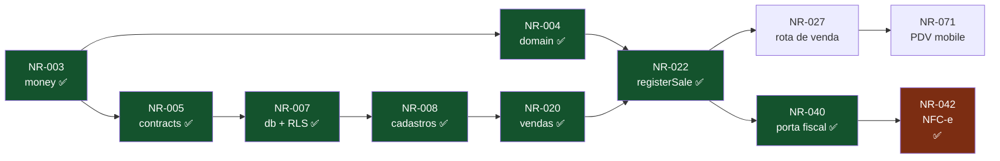

# Task Ledger

Backlog completo dividido em três trilhas. **Fonte da verdade versionada** — o
Monday é a visualização; divergiu, o ledger ganha.

Importação: [`monday-import.csv`](monday-import.csv).

---

## Como ler

| Coluna     | Significado                                                                                                       |
| ---------- | ----------------------------------------------------------------------------------------------------------------- |
| **ID**     | `NR-xxx`, permanente. Aparece na branch, no título do PR, no rodapé do commit e no Monday                         |
| **Trilha** | 🔵 1 Núcleo & Dados · 🟠 2 Plataforma & Integrações · 🟢 3 Clientes                                               |
| **Est**    | estimativa em dias. **Acima de 2 dias, a tarefa deve ser quebrada**                                               |
| **Dep**    | tarefas que precisam estar concluídas antes                                                                       |
| **Bloq**   | o que impede: `DEC-xxx` (decisão em aberto) ou `NR-xxx → DEC-xxx` (dependência travada, com a decisão na raiz)    |
| **Status** | ⬜ a fazer, **pode começar hoje** · 🟨 em andamento · ✅ concluída · 🚧 bloqueada, por decisão ou por dependência |

**⬜ é promessa de que dá para pegar agora.** Tarefa cuja dependência está 🚧
também está 🚧, mesmo que nenhuma decisão fale dela diretamente: `Blocked` no
board é "travada por decisão **ou** dependência"
([rituais](rituais.md#estados-no-monday)), e o planejamento manda que ninguém
comece tarefa bloqueada. Deixá-la ⬜ enche o painel de trabalho que não existe.

**Bloqueado ≠ parado.** Quando o bloqueio é escolha de provedor, a porta e os
testes com adapter falso podem ser escritos antes — é exatamente para isso que
os adapters existem
([princípios](../arquitetura/principios.md#3-adapters-isolam-provedores)).
É por isso que NR-040, NR-043 e NR-045 — as três portas com adapter falso —
dependem de `contracts` (NR-005 ✅) e **não** do caso de uso ou do worker que as
consome. A porta é declarada pelo núcleo; a seta aponta para dentro
([princípio 1](../arquitetura/principios.md#1-core-é-o-núcleo)).

## As trilhas

| Trilha                              | Módulos                                                                              |
| ----------------------------------- | ------------------------------------------------------------------------------------ |
| 🔵 **1 — Núcleo & Dados**           | `money` `domain` `contracts` `db` `core`                                             |
| 🟠 **2 — Plataforma & Integrações** | `api` `worker` `agent` `whatsapp` `fiscal` `banking` `billing` `payments` `infra` CI |
| 🟢 **3 — Clientes**                 | `mobile` `web` `ui`                                                                  |

> **A trilha 1 é o gargalo, e agora ela pode andar.** `money`, `domain` e
> `contracts` já existem, e a [DEC-002](../decisoes/README.md#dec-002) fechou:
> `db` começa em NR-007. Enquanto `db` não sair, as outras duas continuam
> dependendo dela — é a fila mais curta para destravar o resto do backlog.

## Painel

|                               | Tarefas | Dias |
| ----------------------------- | ------: | ---: |
| Total                         |     101 |  253 |
| ✅ Concluídas                 |      91 |  220 |
| 🚧 Bloqueadas por decisão     |       1 |    4 |
| 🚧 Bloqueadas por dependência |       0 |    0 |
| ⬜ A fazer, pode começar hoje |       7 |   22 |

> **Números conferidos contra a `main` em 2026-09-12**, não estimados: cada
> ✅ tem commit mesclado com `Refs: NR-xxx` no histórico. O NR-012 é a
> exceção — foi mesclado antes de a convenção de rodapé existir (PR #15).
> A **NR-060** entra como ✅ **neste PR** (branch `feat/NR-060-runtime-agente`);
> a `main` só passa a contar o squash depois do merge — sem URL de PR ainda.
> A **NR-121** entra como ✅ nesta mesma linha de entrega (branch
> `feat/NR-121-harness-studio`); a `main` só passa a contar o squash depois
> do merge — sem URL de PR ainda.
> A **NR-062** já está ✅ na `main` (#228). A **NR-061** entra como ✅ **neste
> PR** (branch `feat/NR-061-confirmacao-acao-sensivel`); a `main` só passa a
> contar o squash depois do merge — sem URL de PR ainda.
> A **NR-118** fechou com a NR-122: a US-075 pedia "o mesmo caso de uso do
> aplicativo" para cancelar venda, e esse caso de uso nao existia — RF-043 e
> a US-021 estavam no papel desde o inicio, sem tarefa nenhuma cobrindo. A
> NR-122 escreveu o caso de uso, e a tool `cancel_sale` passou a chama-lo.
> Devolucao parcial (RF-044) segue aberta, na propria NR-122.
> As somas saem das linhas deste arquivo e fecham com o
> [`monday-import.csv`](monday-import.csv) que `pnpm ledger:csv` gera.
> Em **2026-09-16** entrou a NR-121 (harness Studio) e a cascata E11 foi
> reordenada: agente/Studio/RAG antes do canal Meta.

> **NR-080 entrou aqui depois de já ter sido entregue.** O suporte foi mesclado
> citando um id que não existia neste arquivo, e a NR-081 (baixa e estorno)
> nasceu reusando o mesmo número — dois trabalhos diferentes apontando para um
> id só, que é exatamente o que a convenção "ID nunca é reaproveitado" existe
> para impedir. A colisão foi desfeita renomeando a NR-081, a mais nova, nos
> comentários dela, e registrando as duas tarefas aqui. O `ledger:check` recusa
> id duplicado **entre linhas**; ele não lê comentário de código, e foi por essa
> fresta que o número passou duas vezes.

**A DEC-002 fechou** — [ADR-0001](../decisoes/adr/0001-rls-por-linha.md), RLS
por linha, com o isolamento já materializado em `packages/db` (NR-007) e os
cadastros, vendas e financeiro no schema (NR-008, NR-020) e os casos de uso de
cadastro, o `registerSale` e a movimentação de estoque em `core` (NR-021,
NR-022, NR-023), a agenda no schema (NR-035) e a trilha de auditoria
(NR-025) e as contas a pagar com baixa e estorno (NR-028, NR-029) os
consumidores de fila (NR-041) e o plano de contas com DRE (NR-032).

Dos **32 dias que faltam, 28 podem começar hoje** — inclusive NR-015 (deploy na
VM), a cascata E11 no Studio (115–119 → NR-120) agora que a NR-121, a NR-061
e a NR-062 estão ✅, depois o canal real (NR-113 + NR-046), e a NR-075 (cupons;
DEC-012 já ADR-0013). Só a DEC-005 (Open Finance) ainda trava tarefa no
quadro (NR-048). Studio é substituto do WhatsApp em engenharia
([ADR-0010](../decisoes/adr/0010-mastra-e-gpt-4o-mini.md) revisão 2026-09-16);
**não** é runtime do lojista.

---

## Sprint 0 — Fundação ✅

| ID     | Tarefa                                                                | Trilha | Módulo         | Est | Dep | Status |
| ------ | --------------------------------------------------------------------- | :----: | -------------- | --: | --- | :----: |
| NR-001 | Workspace pnpm + Turborepo, Docker Compose local, CI, hooks, ESLint   |   🟠   | `repo` `infra` |   3 | —   |   ✅   |
| NR-002 | Base de documentação: produto, arquitetura, engenharia, decisões      |   —    | `docs`         |   4 | —   |   ✅   |
| NR-003 | `packages/money` — centavos, `allocate` sem perda de resto, 21 testes |   🔵   | `money`        |   1 | —   |   ✅   |

## Sprint 1 — Núcleo mínimo

Objetivo: as três trilhas conseguem trabalhar em paralelo sem esperar uma à outra.

| ID     | Tarefa                                                                          | Trilha | Módulo            | Est | Dep    | Bloq                | US/RF                   | Status |
| ------ | ------------------------------------------------------------------------------- | :----: | ----------------- | --: | ------ | ------------------- | ----------------------- | :----: |
| NR-004 | `domain`: cálculo de venda — custo, imposto, tarifa de cartão, parcelas         |   🔵   | `domain`          |   3 | NR-003 | —                   | RF-040, RF-041, RF-038  |   ✅   |
| NR-005 | `contracts`: schemas base (Company, Customer, Product, Sale)                    |   🔵   | `contracts`       |   2 | NR-003 | —                   | RNF-027                 |   ✅   |
| NR-006 | Configuração tipada: validar variáveis de ambiente na inicialização             |   🟠   | `repo`            |   1 | NR-001 | —                   | —                       |   ✅   |
| NR-007 | `db`: estratégia multi-tenant, RLS e teste de isolamento                        |   🔵   | `db`              |   3 | NR-005 | —                   | RF-121, RF-122, RNF-021 |   ✅   |
| NR-008 | `db`: schema de cadastros (companies, users, customers, products)               |   🔵   | `db`              |   2 | NR-007 | —                   | RF-001, RF-009, RF-017  |   ✅   |
| NR-009 | `api`: base — contexto de execução, erro padronizado, validação por `contracts` |   🟠   | `api`             |   2 | NR-005 | —                   | RNF-027, RNF-054        |   ✅   |
| NR-010 | Qualidade: lint com type-checking e piso de cobertura na CI                     |   🟠   | `repo`            |   1 | NR-001 | —                   | RNF-068                 |   ✅   |
| NR-011 | `ui`: tokens de design (cor, tipografia, espaçamento)                           |   🟢   | `ui`              |   2 | —      | **DEC-001**/QST-011 | RNF-055                 |   ✅   |
| NR-012 | `mobile`: shell de navegação e sessão                                           |   🟢   | `mobile`          |   3 | NR-011 | DEC-008             | US-059                  |   ✅   |
| NR-013 | `web`: shell de layout e sessão                                                 |   🟢   | `web`             |   2 | NR-011 | —                   | US-059                  |   ✅   |
| NR-014 | Autenticação: login, papéis, usuário em várias empresas                         |   🟠   | `api` `core` `db` |   5 | NR-009 | —                   | RF-119, RF-120          |   ✅   |
| NR-015 | `infra`: definir hospedagem e preencher os workflows de deploy                  |   🟠   | `infra`           |   3 | —      | —                   | RNF-064, RNF-013        |   ⬜   |

## Sprint 2 — Cadastros e venda

Objetivo: registrar uma venda de ponta a ponta pelo aplicativo.

| ID     | Tarefa                                                                      | Trilha | Módulo         | Est | Dep            | Bloq | US/RF                                      | Status |
| ------ | --------------------------------------------------------------------------- | :----: | -------------- | --: | -------------- | ---- | ------------------------------------------ | :----: |
| NR-020 | `db`: schema de vendas e financeiro                                         |   🔵   | `db`           |   3 | NR-008         | —    | RF-027–044, RF-063                         |   ✅   |
| NR-021 | `core`: casos de uso de cadastro (empresa, cliente, produto)                |   🔵   | `core`         |   3 | NR-008         | —    | RF-001–004, RF-007, RF-009–011, RF-013–019 |   ✅   |
| NR-022 | `core`: `registerSale` — transação única com estoque, recebível e auditoria |   🔵   | `core`         |   4 | NR-020, NR-004 | —    | RF-034–039, RNF-046                        |   ✅   |
| NR-023 | `core`: movimentação de estoque e ajuste com autoria                        |   🔵   | `core`         |   2 | NR-021         | —    | RF-022–024                                 |   ✅   |
| NR-024 | `domain`: desconto (sem alçada por papel) e troco                           |   🔵   | `domain`       |   2 | NR-004         | —    | RF-030, RF-031, RF-035                     |   ✅   |
| NR-025 | `core`: trilha de auditoria somente-inserção                                |   🔵   | `core`         |   2 | NR-020         | —    | RF-123, RF-124                             |   ✅   |
| NR-026 | `api`: rotas de cadastro                                                    |   🟠   | `api`          |   2 | NR-021, NR-009 | —    | RF-001–004, RF-007, RF-009–011, RF-013–019 |   ✅   |
| NR-027 | `api`: rota de venda com chave de idempotência                              |   🟠   | `api`          |   2 | NR-022         | —    | RF-036, RNF-043                            |   ✅   |
| NR-030 | `api`: observabilidade — `requestId`, log estruturado, rastreamento         |   🟠   | `api` `worker` |   2 | NR-009         | —    | RNF-058, RNF-059                           |   ✅   |
| NR-070 | `mobile`: cadastro de produto com leitor de código de barras                |   🟢   | `mobile`       |   3 | NR-026         | —    | US-009, RF-017                             |   ✅   |
| NR-071 | `mobile`: carrinho, seleção de cliente e fechamento de venda                |   🟢   | `mobile`       |   5 | NR-027         | —    | US-014–019                                 |   ✅   |
| NR-072 | `web`: backoffice de cadastros                                              |   🟢   | `web`          |   3 | NR-026         | —    | E1, E2, E3                                 |   ✅   |

## Sprint 3 — Fiscal e financeiro

Objetivo: emitir NFC-e e controlar contas a pagar e receber.

| ID     | Tarefa                                                                | Trilha | Módulo            | Est | Dep    | Bloq | US/RF                  | Status |
| ------ | --------------------------------------------------------------------- | :----: | ----------------- | --: | ------ | ---- | ---------------------- | :----: |
| NR-028 | `core`: contas a pagar e a receber, com recorrência                   |   🔵   | `core`            |   3 | NR-020 | —    | RF-055–067             |   ✅   |
| NR-029 | `core`: baixa, baixa parcial e estorno                                |   🔵   | `core`            |   2 | NR-028 | —    | RF-059, RF-066, RF-067 |   ✅   |
| NR-040 | `fiscal`: porta `InvoiceIssuer` + adapter falso                       |   🟠   | `fiscal` `core`   |   2 | NR-005 | —    | RF-045                 |   ✅   |
| NR-041 | `worker`: consumidores de fila (emissão, mensagem, cobrança)          |   🟠   | `worker`          |   3 | NR-040 | —    | RNF-004, RF-130        |   ✅   |
| NR-042 | `fiscal`: adapter Focus NFe, contingência e guarda de XML             |   🟠   | `fiscal`          |   5 | NR-040 | —    | RF-045–054, RF-146     |   ✅   |
| NR-043 | `payments`: porta `PaymentGateway` + adapter falso                    |   🟠   | `payments` `core` |   2 | NR-005 | —    | RF-063                 |   ✅   |
| NR-044 | `payments`: adapter Asaas — Pix, boleto, link, cartão online, webhook |   🟠   | `payments`        |   4 | NR-043 | —    | RF-034, RF-068         |   🟨   |
| NR-073 | `mobile`: pagamento, resumo com líquido e margem                      |   🟢   | `mobile`          |   3 | NR-071 | —    | US-018–020             |   ✅   |
| NR-074 | `web`: contas a pagar e a receber                                     |   🟢   | `web`             |   4 | NR-029 | —    | E6, E7                 |   ✅   |
| NR-081 | Baixa e estorno de título ligados de verdade, no web e no mobile      |   🟢   | `web` `mobile`    |   3 | NR-074 | —    | RF-059, RF-066, RF-067 |   ✅   |

## Sprint 4 — WhatsApp e assinatura

Objetivo: operar o ERP por mensagem (E11) e cobrar a mensalidade.

| ID     | Tarefa                                                                  | Trilha | Módulo                        | Est | Dep                                                    | Bloq | US/RF                                                         | Status |
| ------ | ----------------------------------------------------------------------- | :----: | ----------------------------- | --: | ------------------------------------------------------ | ---- | ------------------------------------------------------------- | :----: |
| NR-031 | `core`: exportação completa e anonimização (LGPD)                       |   🔵   | `core`                        |   3 | NR-028                                                 | —    | RF-125–128                                                    |   ✅   |
| NR-045 | `whatsapp`: porta `MessageSender` + adapter falso                       |   🟠   | `whatsapp` `core`             |   2 | NR-005                                                 | —    | RF-015                                                        |   ✅   |
| NR-060 | `agent`: runtime mínimo + tools base geradas de `contracts`             |   🟠   | `agent`                       |   5 | NR-005                                                 | —    | US-047–049, US-052, US-053, RF-096–102, 107–109, 136, 149–151 |   ✅   |
| NR-121 | `agent`: harness Mastra Studio → `processMessage` (eng., não lojista)   |   🟠   | `agent` `api`                 |   2 | NR-060                                                 | —    | ADR-0010 (rev.), RNF-006                                      |   ✅   |
| NR-061 | `agent`: confirmação de ação sensível, com expiração                    |   🟠   | `agent`                       |   2 | NR-060, NR-121                                         | —    | US-050, RF-103, RF-104                                        |   ✅   |
| NR-062 | `agent`: contexto de conversa isolado por empresa                       |   🟠   | `agent`                       |   3 | NR-060, NR-121                                         | —    | US-051, RF-105, RF-106, ADR-0016                              |   ✅   |
| NR-115 | `agent`: consultar estoque, a pagar e fiado por mensagem                |   🟠   | `agent`                       |   2 | NR-060, NR-061, NR-062                                 | —    | US-065–067, RF-133–135                                        |   ✅   |
| NR-116 | `agent`: foto do código de barras (SHOULD)                              |   🟠   | `agent`                       |   2 | NR-060, NR-061, NR-062                                 | —    | US-068, RF-137–139                                            |   ✅   |
| NR-117 | `agent`: cadastrar produto e lançar pagar/receber por mensagem          |   🟠   | `agent`                       |   2 | NR-060, NR-061, NR-062                                 | —    | US-069–071, RF-140–142                                        |   ✅   |
| NR-118 | `agent`: baixas, ajuste de estoque e cancelar/devolver venda            |   🟠   | `agent`                       |   2 | NR-060, NR-061, NR-062, NR-042                         | —    | US-072–075, RF-143–145, RF-147                                |   ✅   |
| NR-122 | `core`: cancelar venda estornando estoque, recebiveis e carteira        |   🔵   | `contracts` `core` `db` `api` |   3 | NR-022                                                 | —    | RF-043, RF-044, US-021                                        |   🟨   |
| NR-119 | `agent`: criar compromisso por mensagem (COULD)                         |   🟠   | `agent`                       |   1 | NR-060, NR-061, NR-062, NR-034                         | —    | US-076, RF-148                                                |   ✅   |
| NR-120 | `agent` + `db`: RAG auxiliar (store com `company_id`, retrieve top‑k)   |   🟠   | `agent` `db`                  |   2 | NR-007, NR-062, NR-115, NR-116, NR-117, NR-118, NR-119 | —    | RF-102, RNF-075, ADR-0017                                     |   ⬜   |
| NR-113 | Canal WhatsApp: celular do owner é o vínculo; PeerDirectory             |   🟠   | `core` `api` `agent` `web`    |   3 | NR-014, NR-084, NR-120                                 | —    | US-046, RF-094, RF-095, RF-132                                |   ⬜   |
| NR-046 | `whatsapp`: adapter Meta Cloud API, webhook e consentimento             |   🟠   | `whatsapp`                    |   4 | NR-045, NR-113                                         | —    | RF-016, ADR-0014                                              |   ⬜   |
| NR-063 | `billing`: assinatura, trial, inadimplência e estado restrito           |   🟠   | `billing`                     |   4 | NR-044                                                 | —    | RF-110–118                                                    |   ⬜   |
| NR-114 | Conta de Parceiro e esquema de cupons: schema, ADR-0013 (fecha DEC-012) |   🔵   | `db`                          |   2 | —                                                      | —    | RF-114, RF-115                                                |   ✅   |
| NR-075 | `web`: planos, assinatura e cupom                                       |   🟢   | `web`                         |   3 | NR-063                                                 | —    | E12, ADR-0013                                                 |   ⬜   |

**NR-060 (entregue neste PR):** runtime mínimo Mastra + tools de `contracts`
(US-047–049, US-052, US-053/RF-108, recusas RF-149–151), harness de fixture
com FakeLlm. Status ✅ nesta branch — sem URL de PR ainda. O resumo de
período cobre RF-108 (faturamento, custo, despesas, resultado; texto
truncado se não couber). **RF-109** (arquivo ou link para detalhe grande)
permanece dívida técnica explícita e **não** bloqueia o merge; não há
linha nova no ledger para isso. Ver `packages/agent/README.md`.

**NR-121 (entregue neste PR):** harness Mastra Studio no Fastify da API
(`@mastra/fastify` atrás do porteiro). Agent-relé `studio-harness` / tool
`process_message` chama o mesmo `processMessage` da NR-060 (`channel:
'whatsapp'`, peer forjado). Sem `/api/agents` de negócio; `POST
/agent/messages` inalterado. Observabilidade: `durationMs` no envelope da
tool + log `agent.studio.turn`. Status ✅ nesta branch
(`feat/NR-121-harness-studio`) — sem URL de PR ainda. Confirmação persistente
fecha na NR-061; Memory/RAG/Meta ficam fora.

**NR-061 (entregue neste PR):** confirmação de ação sensível persiste na
tabela `confirmations` (RLS + `withTenant`), ligada a um stub de
`conversations`. `InMemoryConfirmations` fica só no teste. HTTP `app:` e
Studio `wa:` **não** cruzam chave. Sem HITL Mastra, sem gravar `messages`
(NR-062). Status ✅ nesta branch (`feat/NR-061-confirmacao-acao-sensivel`)
— sem URL de PR ainda.

**NR-115 (entregue neste PR):** consultas conversacionais somente-leitura —
`check_stock`, `list_payables`, `check_customer_wallet` — com schemas de
`contracts`, casos de uso em `core`, migration `0022_produto_estoque_localizacao`
(`tracks_stock`, `location`) e harness FakeLlm/HTTP. Leituras sem confirmação
nem escrita; homônimos expõem alternativas sem saldo. Status ✅ nesta branch
(`feat/NR-115-consultar-estoque-pagar-fiado`) — sem URL de PR ainda.

**NR-116 (entregue neste PR):** foto do código de barras no laço conversacional
— `agentMessageInputSchema` com texto e/ou imagem; porta `BarcodeDecoder` com
`FakeBarcodeDecoder` na CI (sem ZXing real); gate de foto **antes** do LLM;
rotas de venda (`clarify` → pagamento → `create_sale`), recusa e cadastro
explícito (não venda); histórico com `[foto do codigo]` sem bytes; harness
HTTP e Studio (`relay-agent` repassa `image` como bytes). Status ✅ nesta branch
(`feat/NR-116-foto-codigo-barras`) — sem URL de PR ainda.

## Sprint 5 — Bancos e relatórios

| ID     | Tarefa                                                         | Trilha | Módulo         | Est | Dep    | Bloq        | US/RF          | Status |
| ------ | -------------------------------------------------------------- | :----: | -------------- | --: | ------ | ----------- | -------------- | :----: |
| NR-032 | `core`: plano de contas, classificação e DRE simplificado      |   🔵   | `core`         |   4 | NR-028 | —           | RF-081–088     |   ✅   |
| NR-033 | `core`: conciliação com sugestão por valor e data              |   🔵   | `core`         |   3 | NR-032 | —           | RF-078–080     |   ✅   |
| NR-047 | `banking`: importação de OFX/CSV                               |   🟠   | `banking`      |   3 | NR-033 | —           | RF-076, RF-077 |   ✅   |
| NR-048 | `banking`: Open Finance                                        |   🟠   | `banking`      |   4 | NR-047 | **DEC-005** | RF-074, RF-075 |   🚧   |
| NR-076 | `web`: conciliação bancária                                    |   🟢   | `web`          |   3 | NR-033 | —           | US-038         |   ✅   |
| NR-077 | Relatórios: DRE, ranking e faturamento, no app e no assistente |   🟢   | `web` `mobile` |   4 | NR-032 | —           | US-041, US-053 |   ✅   |

## Backlog

| ID     | Tarefa                                                          | Trilha | Módulo                  | Est | Dep    | Bloq | US/RF                  | Status |
| ------ | --------------------------------------------------------------- | :----: | ----------------------- | --: | ------ | ---- | ---------------------- | :----: |
| NR-016 | `CHANGELOG` gerado dos commits + processo de release            |   🟠   | `repo`                  |   1 | —      | —    | —                      |   ✅   |
| NR-034 | `core`: agenda e lembretes                                      |   🔵   | `core`                  |   2 | —      | —    | RF-089–093             |   ✅   |
| NR-035 | `db`: schema de agenda (`appointments`)                         |   🔵   | `db`                    |   1 | NR-008 | —    | RF-089, RF-090         |   ✅   |
| NR-036 | `api`: rotas de agenda                                          |   🟠   | `api`                   |   1 | NR-035 | —    | RF-089–093             |   ✅   |
| NR-037 | `db`: repositórios da venda e trilha de estoque                 |   🔵   | `db`                    |   2 | NR-020 | —    | RF-024, RNF-046        |   ✅   |
| NR-049 | E2E do caminho crítico (3 fluxos)                               |   🟠   | `repo`                  |   3 | NR-071 | —    | RNF-068                |   ⬜   |
| NR-078 | `mobile`: agenda                                                |   🟢   | `mobile`                |   2 | NR-036 | —    | US-043–045             |   ✅   |
| NR-079 | `web`: conteúdo real da landing                                 |   🟢   | `web`                   |   1 | —      | —    | —                      |   ✅   |
| NR-080 | Suporte: schema, casos de uso, rotas e web                      |   🔵   | `db` `core` `api` `web` |   3 | NR-008 | —    | US-062                 |   ✅   |
| NR-082 | `mobile`: suporte                                               |   🟢   | `mobile`                |   2 | NR-080 | —    | US-062                 |   ✅   |
| NR-083 | Sessão persistente e revogável, e desaceleração no banco        |   🔵   | `db` `core` `api`       |   3 | NR-014 | —    | RF-119, RF-120         |   ✅   |
| NR-084 | Better Auth como provedor de identidade, em schema próprio      |   🟠   | `api` `db`              |   3 | NR-083 | —    | RF-119, RF-120         |   ✅   |
| NR-085 | Cookies, privacidade e termos: páginas e inventário com portão  |   🟢   | `web` `docs`            |   2 | —      | —    | RF-125, RNF-029        |   ✅   |
| NR-086 | Direitos do titular: exportação completa e anonimização ligadas |   🔵   | `db` `api` `web`        |   3 | NR-031 | —    | RF-125, RF-127, RF-128 |   ✅   |
| NR-087 | Trilha de auditoria persistente, e dentro da transação          |   🔵   | `db` `core` `api`       |   3 | NR-025 | —    | RF-123, RF-124, US-061 |   ✅   |

## Sprint 6 — Catálogo 0909

Objetivo: o banco vivo é o recorte `db_0909.sql` no domínio, com identidade,
sessão, cofre e extrato da `main` às margens. Baseline novo; IDs antigos não
voltam a ⬜.

| ID     | Tarefa                                                                                     | Trilha | Módulo                                       | Est | Dep                                    | Bloq | US/RF                                              | Status |
| ------ | ------------------------------------------------------------------------------------------ | :----: | -------------------------------------------- | --: | -------------------------------------- | ---- | -------------------------------------------------- | :----: |
| NR-088 | Adendo oficial 0909 + plataforma, DEC-019/ADR-0006, abrir NR-089–098                       |   —    | `docs`                                       |   1 | —                                      | —    | RNF-048                                            |   ✅   |
| NR-089 | `db`: baseline 0001–0007 (0909 + identidade/sessão/cofre/banco); apaga 0001–0025 velhos    |   🔵   | `db`                                         |   2 | NR-088                                 | —    | RF-121, RF-122, RNF-021                            |   ✅   |
| NR-090 | `db`: repositórios de cadastro no shape 0909 (endereço, produto, categoria)                |   🔵   | `db`                                         |   2 | NR-089                                 | —    | RF-001, RF-009, RF-017                             |   ✅   |
| NR-091 | `db` + `contracts`: venda, itens, pagamentos PSP, estoque, idempotência                    |   🔵   | `db` `contracts`                             |   2 | NR-089                                 | —    | RF-034–039, RNF-046                                |   ✅   |
| NR-092 | `db` + `contracts`: `ledger_accounts`, `outstanding_cents`, `settlements` unificados       |   🔵   | `db` `contracts`                             |   2 | NR-089                                 | —    | RF-055–067, RF-081                                 |   ✅   |
| NR-093 | `db`: `invoices` 0909 + `company_integrations` convivendo com o cofre fiscal               |   🔵   | `db`                                         |   2 | NR-089                                 | —    | RF-004, RF-045–054, RF-146                         |   ✅   |
| NR-094 | `db` + `contracts`: `ticket_messages`, status EN de suporte, `audit_logs`                  |   🔵   | `db` `contracts`                             |   2 | NR-089                                 | —    | US-062, RF-123, RF-124                             |   ✅   |
| NR-095 | `db`: conciliação nas FKs novas + inventário da exportação LGPD                            |   🔵   | `db`                                         |   2 | NR-090, NR-092                         | —    | RF-078–080, RF-125, RF-127                         |   ✅   |
| NR-096 | `api`: composition e rotas cujo SQL/contrato mudou                                         |   🟠   | `api`                                        |   2 | NR-090, NR-091, NR-092, NR-093, NR-094 | —    | RF-001–004, RF-007, RF-009–011, RF-013–019, RF-036 |   ✅   |
| NR-097 | `web` + `mobile`: vocabulário e campos (venda, suporte, endereço, categoria)               |   🟢   | `web` `mobile`                               |   2 | NR-096                                 | —    | US-014–019, US-062                                 |   ✅   |
| NR-098 | Merge do baseline na `main` e `infra:reset` no setup                                       |   🟠   | `repo` `infra`                               |   1 | NR-095, NR-096, NR-097                 | —    | RNF-048                                            |   ✅   |
| NR-099 | Tema claro do painel: alternancia com persistencia e paridade AA de contraste              |   🟢   | `web` `ui`                                   |   1 | —                                      | —    | RNF-055                                            |   ✅   |
| NR-100 | Polish do painel: som e animacao na venda fechada, skeleton e mascote nos vazios           |   🟢   | `web`                                        |   1 | —                                      | —    | RNF-055                                            |   ✅   |
| NR-101 | Tutorial guiado no primeiro login: spotlight pelo dashboard e pela barra lateral           |   🟢   | `web`                                        |   1 | —                                      | —    | —                                                  |   ✅   |
| NR-102 | Corrige o tema claro: sidebar/topbar e ~20 preenchimentos que so funcionavam no escuro     |   🟢   | `web`                                        |   1 | —                                      | —    | RNF-055                                            |   ✅   |
| NR-103 | Logo "Ei Buddy" no painel so atualiza a tela — nao navega mais pro site institucional      |   🟢   | `web`                                        |   1 | —                                      | —    | —                                                  |   ✅   |
| NR-104 | Sino com aviso de cliente inativo, meta diaria e checklist de primeiros passos             |   🟢   | `web`                                        |   2 | —                                      | —    | —                                                  |   ✅   |
| NR-105 | Super Admin: "entrar como" auditado (ADR-0007), do banco ao painel                         |   🔵   | `db` `contracts` `core` `api` `web`          |   4 | —                                      | —    | RF-131                                             |   ✅   |
| NR-106 | DEC-021: conexao entre usuarios por proximidade adiada para a Fase 4 (Rede)                |   —    | `docs`                                       |   1 | —                                      | —    | —                                                  |   ✅   |
| NR-107 | Conexao entre usuarios por proximidade: busca cross-tenant e pedido auditado (ADR-0008)    |   🔵   | `db` `contracts` `core` `api` `web`          |   5 | —                                      | —    | RF-01–05 (spec)                                    |   ✅   |
| NR-108 | Sugestao de conexao por filtragem colaborativa de ramo, sem IA (ADR-0009)                  |   🔵   | `db` `contracts` `core` `api` `web`          |   1 | NR-107                                 | —    | RF-01 (spec, aditivo)                              |   ✅   |
| NR-109 | Quadro de CRM: pendencias e contatos em Kanban, do banco ao mobile (comentario e equipe)   |   🟢   | `db` `contracts` `core` `api` `web` `mobile` |   4 | —                                      | —    | —                                                  |   ✅   |
| NR-110 | Custos fixos: cadastro, edicao e "gerar contas do mes", do banco a tela                    |   🟢   | `db` `contracts` `core` `api` `web`          |   4 | NR-077                                 | —    | —                                                  |   ✅   |
| NR-111 | Pre-lancamento: landing sem acesso, lista de espera e painel de respostas do Super Admin   |   🟢   | `db` `contracts` `core` `api` `web`          |   5 | —                                      | —    | —                                                  |   ✅   |
| NR-112 | Painel da lista de espera: acesso provisorio por chave, sem esperar o primeiro Super Admin |   🟢   | `api` `web`                                  |   1 | NR-111                                 | —    | —                                                  |   ✅   |

---

## Caminho crítico

O que atrasa o MVP inteiro se atrasar:

**NR-007 era o nó mais crítico do projeto, e está feito.** O isolamento por RLS
vive em `packages/db`: a função `enable_tenant_isolation`, o `withTenant` que
liga o `ExecutionContext` à política, e doze testes contra Postgres de verdade
provando que empresa não lê, grava, altera nem apaga linha de outra
([ADR-0001](../decisoes/adr/0001-rls-por-linha.md)).

**O `registerSale` está feito** — a transação única que grava venda, itens,
pagamentos, recebíveis e a baixa de estoque juntos, com idempotência pela chave
do contexto e rollback provado em teste (RNF-046).

**A NR-027 destravou, e o nó encolheu.** Esta nota dizia que a rota de venda
não era executável porque `packages/db` não implementava porta nenhuma. Isso
mudou: `createSaleUnitOfWork` e `createUserDirectory` existem agora, e a
NR-027 foi feita contra o repositório **real** — Postgres, transação com tenant
definido, idempotência pelo índice único.

A configuração de venda (alíquota, tarifas de cartão) segue
sem tabela, e por isso a rota usa `createDefaultSaleSettings` de `core` — que
é o que a própria porta `CompanySettingsRepository` prevê ("quem implementa
hoje devolve a configuração que tiver"). Quando as tabelas existirem, muda uma
função na raiz de composição.

**O que continua bloqueado:** a NR-026 (rotas de cadastro) e a NR-036 (rotas de
agenda) precisam de repositórios de cliente, produto e compromisso, e nenhum
existe. Segue como **pendência de planejamento**: nenhuma tarefa do ledger cria
esses repositórios, e uma rota ligada a um _fake_ não é uma rota.

## Bloqueios por decisão

| Decisão                                                                                  | Diretas                         | Em cascata | Dias parados |
| ---------------------------------------------------------------------------------------- | ------------------------------- | ---------: | -----------: |
| [DEC-007](../decisoes/README.md#dec-007) LLM ✅ Mastra + `gpt-4o-mini`                   | — (NR-060 ✅; Studio NR-121 ✅) |          — |            0 |
| [DEC-004](../decisoes/README.md#dec-004) fiscal ✅                                       | — (NR-042 ✅)                   |          — |            0 |
| [DEC-003](../decisoes/README.md#dec-003) WhatsApp ✅ Meta Cloud API                      | — (NR-046 ⬜, após NR-113/120)  |          — |            0 |
| [DEC-010](../decisoes/README.md#dec-010) cobrança ✅                                     | — (NR-063 ⬜)                   |          — |            0 |
| [DEC-006](../decisoes/README.md#dec-006)/[DEC-015](../decisoes/README.md#dec-015) PSP ✅ | — (NR-044 ⬜)                   |          — |            0 |
| [DEC-005](../decisoes/README.md#dec-005) Open Finance                                    | NR-048                          |          — |            4 |
| [DEC-003](../decisoes/README.md#dec-003) fluxo 3 do E2E ✅                               | — (NR-049 ⬜)                   |          — |            0 |
| [DEC-009](../decisoes/README.md#dec-009) hospedagem ✅ VPS                               | — (NR-015 ⬜)                   |          — |            0 |
| [DEC-011](../decisoes/README.md#dec-011) contexto da conversa ✅                         | — (NR-062 ✅)                   |          — |            0 |
| [DEC-012](../decisoes/README.md#dec-012) usuário e cupons ✅                             | — (NR-075 ⬜)                   |          — |            0 |
| [DEC-001](../decisoes/README.md#dec-001) nome/marca                                      | — (NR-011 ✅)                   |          — |            0 |

> **Bloqueio de tarefa não é bloqueio de trabalho.** DEC-003, DEC-009,
> DEC-011 e DEC-012 fecharam. O que ainda está 🚧 por decisão no quadro é
> Open Finance (DEC-005 / NR-048). Ver
> [destravar-os-bloqueios.md](destravar-os-bloqueios.md).

**Dos 42 dias-desenvolvedor que restam, 38 estão liberados.**
O único bloqueio de decisão no ledger é Open Finance (DEC-005, 4 dias).

Cada tarefa é contada **uma vez**, na decisão que aparece na sua própria coluna
`Bloq`.

**Nenhuma decisão restante domina como a DEC-002 dominava.** A que ainda
trava linha no ledger é a [DEC-005](../decisoes/README.md#dec-005) (Open
Finance, SHOULD). Assistente: memória [ADR-0016](../decisoes/adr/0016-memoria-da-conversa-tabelas-nossas.md),
RAG [ADR-0017](../decisoes/adr/0017-rag-com-tools-e-rls.md).

A [DEC-008](../decisoes/README.md#dec-008) fechou pela
[ADR-0002](../decisoes/adr/0002-autenticacao-identidade-propria.md) e devolveu
6 dias — `NR-013` e `NR-014`. Vale registrar como ela fechou, porque o padrão
serve para as que faltam: a decisão travada era **qual provedor**, e o que
travava o código era **quem é dono do papel e da sessão**. Separadas, a segunda
foi decidida na hora e a primeira virou escolha de configuração. A hospedagem
já não espera ninguém.

A [DEC-001](../decisoes/README.md#dec-001) fechou pela
[ADR-0011](../decisoes/adr/0011-eibuddy-nome-e-dominio.md): produto **EiBuddy**,
domínio **eibuddy.com.br**. NR-011 já tinha sido entregue com a paleta
provisória de
[`packages/ui/src/tokens/color.ts`](../../packages/ui/src/tokens/color.ts).
O retrabalho que resta é visual (tokens), não naming.

## Carga por trilha

| Trilha                          | Tarefas | Dias | Observação                                         |
| ------------------------------- | ------: | ---: | -------------------------------------------------- |
| 🔵 1 — Núcleo & Dados           |      35 |   88 | Conta de Parceiro e cupons (NR-114, ADR-0013)      |
| 🟠 2 — Plataforma & Integrações |      36 |   91 | E11 + RAG + canal (113/046); Studio NR-121 ✅      |
| 🟢 3 — Clientes                 |      27 |   68 | lista de espera de pré-lançamento (NR-111, NR-112) |
| Compartilhada                   |       3 |    6 | documentação (NR-002, NR-088, NR-106)              |

Somando: **253 dias-desenvolvedor** em 101 tarefas. Com 3 pessoas, isso é cerca
de 13 semanas de trabalho — desde que nada fique bloqueado, o que não é o caso
hoje.

A trilha 3 não está mais ociosa por falta de `ui`: NR-011 e NR-012 saíram com a
paleta provisória. O que resta dela depende de schema — de NR-020 em diante —
mas depender não é estar bloqueada: com a DEC-002 fechada, é fila, não parede.

## Convenções

| Regra                                           | Motivo                                                   |
| ----------------------------------------------- | -------------------------------------------------------- |
| Tarefa acima de 2 dias é quebrada               | estimativa grande é estimativa errada                    |
| Toda tarefa tem `US-xxx` ou `RF-xxx`            | trabalho sem requisito é trabalho sem critério de pronto |
| Tarefa bloqueada referencia a `DEC-xxx`         | e a `DEC` referencia a tarefa de volta                   |
| ID nunca é reaproveitado                        | tarefa cancelada fica como cancelada; o número queima    |
| Tarefa com dependência 🚧 também é 🚧           | ⬜ promete que dá para começar hoje                      |
| Painel e cargas conferem com as linhas          | soma errada é pior que soma nenhuma                      |
| Este arquivo é atualizado **no PR**, não depois | ledger desatualizado é pior que ledger nenhum            |

## Documentos relacionados

- [`monday-import.csv`](monday-import.csv) — o mesmo ledger, para importar
- [Rituais](rituais.md) — DoR, DoD, cerimônias
- [Fluxo de trabalho](../engenharia/fluxo-de-trabalho.md) — o ciclo de uma tarefa
- [Decisões](../decisoes/README.md) — o que está bloqueando
